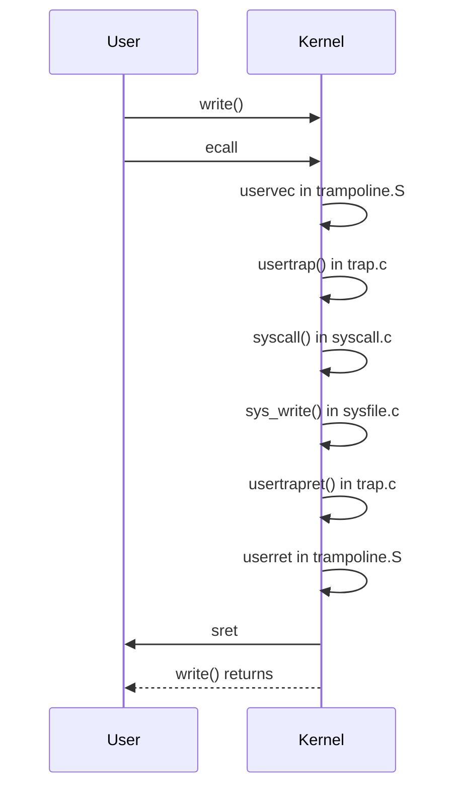

# Lecture 6: System Call Entry/Exit

## Today: User -> Kernel Transition

- **System calls, exceptions, and device interrupts** enter the kernel in the same way.
- **Lots of careful design and important detail** is required.
- **Important for isolation and performance**.

### What Needs to Happen When a Program Makes a System Call, e.g., `write()`?

[CPU User/Kernel Diagram]

- CPU resources are set up for user execution (not kernel):
  - 32 registers, PC, privilege mode, SATP.
- What needs to happen?
  - Save 32 user registers and PC.
  - Switch to supervisor mode.
  - Switch to kernel page table.
  - Switch to kernel stack.
  - Jump to kernel C code.

### High-Level Goals

- **Don't let user code interfere** with user->kernel transition.
  - e.g., don't execute user code in supervisor mode!
- **Transparent to user code** -- resume without disturbing.

## Focus: User/Kernel Transition

Ignoring what the system call implementation does once in the kernel.

### Preview



### Watching an xv6 System Call Entering/Leaving the Kernel

- xv6 shell writing its $ prompt
  - `user/sh.c` line 137: `write(2, "$ ", 2);`
  - `user/usys.S` line 29
    - This is the `write()` function, still in user space.
- `a7` tells the kernel what system call we want -- `SYS_write = 16`
- `ecall` -- triggers the user/kernel transition

### Breakpoint on the ecall

```sh
$ make qemu-gdb
$ gdb
(gdb) b *0xe18
(gdb) c
(gdb) delete 1
(gdb) b usertrapret
(gdb) x/3i 0xe16
```

### Printing the Registers

```sh
(gdb) p $pc
(gdb) p $sp
(gdb) p $a0  # fd
(gdb) p/x $a1  # "$ "
(gdb) p $a2  # n
```

- `$pc` and `$sp` are at low addresses -- user memory starts at zero.
- C on RISC-V puts function arguments in `a0`, `a1`, `a2`, etc.
- `write()` arguments: `a0` is fd, `a1` is buf, `a2` is n.

```sh
(gdb) x/2c $a1
```

- The shell is printing the $ prompt, as we expected.

### What Page Table is in Use?

```sh
(gdb) p/x $satp  # Not very useful
qemu: control-a c, info mem
```

- There are mappings for seven pages:
  - Instructions x2, data, stack guard (no `PTE_U`), stack.
  - Then two high pages: trapframe and trampoline.
    - Data and code for user->kernel transition.
  - There are no mappings for kernel memory, devices, physical memory.

### Execute the ecall

```sh
(gdb) stepi
```

- Where are we?
  - `(gdb) p $pc` - A very high virtual address -- the trampoline.
  - `(gdb) x/6i $pc` - This is `uservec` in `kernel/trampoline.S`.
    - It's the start of the kernel's trap handling code.
  - `(gdb) p $sp`
  - `(gdb) p $a0`
    - The registers hold user values (except $pc).
  - `qemu: info mem`
    - We're still using the user page table.
    - `$pc` is in the very last page, the trampoline.

### Trampoline: The Start of the Kernel's Trap Handling Code

- Must be in user page table since `ecall` doesn't change `satp`.
- At the top to avoid punching a hole in user virtual address space.
- Protected: no `PTE_U` flag.

### The Kernel Previously Set `$stvec` to the Trampoline Page

```sh
(gdb) p/x $stvec
```

### Can We Tell That We're in Supervisor Mode?

- No direct way to find the mode.
- Observe `$pc` is executing in a page with no `PTE_U` flag.
  - Lack of crash implies we are in supervisor mode.

### How Did We Get Here?

- `ecall` did four things:
  - Change mode from user to supervisor.
  - Save `$pc` in `$sepc`.
    ```sh
    (gdb) p/x $sepc
    ```
  - Jump to `$stvec` (i.e., set `$pc` to `$stvec`).
  - Disable (really postpone) further interrupts.
    ```sh
    (gdb) p/x $sstatus
    ```
    - SIE `0x02` is clear (the `0x20` is SPIE -- previous).

### Note: `ecall` Lets User Code Switch to Supervisor Mode

- But the kernel immediately gains control via `$stvec`.
- So the user program itself can't execute as supervisor.

### What Needs to Happen Now?

- Save the 32 user register values (for later transparent resume).
- Switch to kernel page table.
- Set up stack for kernel C code.
- Jump to kernel C code -- `usertrap()`.

### Why Didn't the RISC-V Designers Have `ecall` Do These Things for Us?

- To give O/S designers scope for very fast syscalls/exceptions/intrs.
  - Maybe O/S can handle some traps without switching page tables.
  - Maybe we can map BOTH user and kernel into a single page table.
    - So no page table switch required.
  - Maybe some registers do not have to be saved.
  - Maybe no stack is required for simple system calls.
- So `ecall` does as little as possible.

### Can We Just Write the 32 Registers Somewhere Convenient in Physical Memory?

- No, even supervisor mode is constrained to use the page table.

### Can We First Set `satp` to the Kernel Page Table?

- Supervisor mode is allowed to set `satp`.
- But we don't know the address of the kernel page table at this point.
- And we need a free register to even execute `csrw satp, $xx`.

### We Need One of the 32 General Purpose Registers to Hold an Address

- Of the memory into which we'll save the 32 user registers.
- But all 32 hold user values which we must preserve for eventual return.

### Two Parts to the Solution for Where to Save the 32 User Registers:

1. **xv6 maps a 2nd kernel page**, the trapframe, into the user page table:
   - At a known virtual address, always the same: `0x3fffffe000`.
   - Trapframe has space to hold the saved registers.
   - The kernel gives each process a different trapframe page.
   - See `struct trapframe` in `kernel/proc.h`.
   - (But we still need a register holding the trapframe's address...)
2. **RISC-V provides the `sscratch` register**:
   - Supervisor code can use `sscratch` for temporary storage.
   - User code isn't allowed to use `sscratch`, so no need to save.

### See This at the Start of `uservec` in `trampoline.S`:

```asm
csrw sscratch, a0
```

- Then a few instructions to load `TRAPFRAME` into `a0`.

```sh
(gdb) stepi
(gdb) p/x $sscratch  # 0x2, the old first argument (fd)
(gdb) stepi
(gdb) stepi
(gdb) stepi
(gdb) p/x $a0  # Address of the trapframe
```

- Now `uservec()` has 32 saves of user registers to the trapframe, via `a0`.
  - So they can be restored later, when the system call returns.
  - Let's skip them.

```sh
(gdb) b *0x3ffffff07e
(gdb) c
```

### Setting Up to Be Able to Run C Code in the Kernel

- Couldn't before this, since C code would have overwritten user registers and stack; thus trampoline is assembler.
- First a stack:
  - Previously, kernel put a pointer to top of this process's kernel stack in trapframe.
  - Look at `struct trapframe` in `kernel/proc.h`.
  - "ld sp, 8(a0)" fetches the kernel stack pointer.
  - Remember `a0` points to the trapframe.
  - At this point, the only kernel data mapped in the page table is the trapframe, so everything has to be loaded from there.

```sh
(gdb) stepi
```

### Retrieve Hart ID into `tp`

```sh
(gdb) stepi
```

### We Want to Jump to the Kernel C Function `usertrap()`

- The kernel previously saved it in the trapframe.
  - "ld t0, 16

(a0)" fetches it into `t0`, we'll use it in a moment, after switching to the kernel page table.

```sh
(gdb) stepi
```

### Load a Pointer to the Kernel Page Table from the Trapframe

- Load it into `satp`, and issue an `sfence` to clear the TLB.

```sh
(gdb) stepi
(gdb) stepi
(gdb) stepi
```

- Why isn't there a crash when `satp` is changed?
  - After all, we just switched page tables while executing!
  - Answer: the trampoline page is mapped at the same virtual address in the kernel page table as well as every user page table.

```sh
(gdb) p $pc
qemu: info mem
```

- With the kernel page table, we can now use kernel functions and data.

### The `jr t0` is a Jump to `usertrap()` (Using `t0` Retrieved from Trapframe)

```sh
(gdb) p/x $t0
(gdb) p usertrap
(gdb) stepi
(gdb) layout src
```

- We're now in `usertrap()` in `kernel/trap.c`.
  - All traps from user-space follow the path we've just seen.
  - System calls, device interrupts, exceptions.

### Q: What if a Device Interrupt Occurs While Executing in the Trampoline Code?

- `usertrap()` looks in the `scause` register to see the trap cause:
  ```sh
  (gdb) p $scause
  ```
  - Page 71 of `riscv-privileged-X.pdf` -- Table 4.2.
  - `scause = 8` is a system call.

```sh
(gdb) next ... until syscall()
(gdb) step
(gdb) next
```

- Now we're in `syscall()` `kernel/syscall.c`.
- `myproc()` uses `tp` to retrieve current `struct proc *`.
  - `p->xxx` is usually a slot in the current process's `struct proc`.

### `syscall()` Retrieves the System Call Number from Saved Register `a7`

- `p->trapframe` points to the trapframe, with saved registers.
- `p->trapframe->a7` holds 16, `SYS_write`.
- `p->trapframe->a0` holds `write()` first argument -- fd.
- `p->trapframe->a1` holds buf.
- `p->trapframe->a2` holds n.

### Q: Why Can't This Code Just Look at `a7`? Why Must It Look in `p->trapframe`?

```sh
(gdb) next ...
(gdb) p num
```

- Then dispatches through `syscalls[num]`, a table of functions.

```sh
(gdb) p syscalls[num]
(gdb) next ...
(gdb) step
```

- Aha, we're in `sys_write`.
- At this point, system call implementations are fairly ordinary C code.
- Let's skip to the end, to see how a system call returns to user space.

```sh
(gdb) finish
```

- Notice that `write()` produced console output (the shell's $ prompt).
- `syscall()`'s `p->tf->a0` assignment causes (eventually) `a0` to hold the return value.
  - The C calling convention on RISC-V puts return values in `a0`.

```sh
(gdb) next
```

### Back to `usertrap()`

```sh
(gdb) p p->trapframe->a0
```

- `write()` returned 2 -- two characters -- $ and space.

```sh
(gdb) next
(gdb) step
```

- Now we're in `usertrapret()`, which starts the process of returning to the user program.

```sh
(gdb) b 129
```

### Prepare for the Next User->Kernel Transition

- `stvec = uservec` (the trampoline), for the next `ecall`.
- Trapframe `satp = kernel page table`, for next `uservec`.
- Trapframe `sp = top of kernel stack`.
- Trapframe `trap = usertrap`.
- Trapframe `hartid = hartid` (in `tp`).

### At the Very End, We'll Use the RISC-V `sret` Instruction

- We need to prepare a few registers that `sret` uses:
  - `sstatus` -- set the "previous mode" bit to user.
  - `sepc` -- the saved user program counter (from trap entry).

### We'll Need to Switch to the User Page Table

- Not OK in `usertrapret()`, since it's not mapped in the user page table.
- Need a page that's mapped in both user and kernel page table -- the trampoline.
- Jump to `userret` in `trampoline.S`.

```sh
(gdb) tui disable
(gdb) step
(gdb) x/8i $pc
```

- `a0` holds user page table address.
- The `csrw satp` switches to the user address space.

```sh
(gdb) stepi
(gdb) stepi
(qemu) info mem
```

- Now 32 loads from the trapframe into registers.
  - These restore the user registers.
  - Let's skip over them.

```sh
(gdb) b *0x3ffffff11a
(gdb) c
```

- `a0` is restored last, after which we can no longer get at `TRAPFRAME`.

```sh
(gdb) p/x $a0  # The return value from write()
```

- Now we're at the `sret` instruction.

### `sret`:

- Copies `sepc` to `pc`.
- Changes mode to user.
- Re-enables interrupts (really copies SPIE to SIE).

```sh
(gdb) p $pc
(gdb) p $sepc
(gdb) stepi
(gdb) p $pc
```

- Now we're back in the user program (`$pc = 0xe1c`).
  - Returning 2 from the `write()` function.

```sh
(gdb) p/x $a0
```

### Summary

- System call entry/exit is far more complex than function call.
- Much of the complexity is due to the requirement for isolation and the desire for simple and fast hardware mechanisms.
- A few design questions to ponder:
  - Can an evil program abuse the entry mechanism?
  - Can you think of ways to make the hardware or software simpler?
  - Can you think of ways to make traps faster?
```
